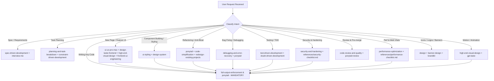

# GoPA — AI Agent Operations & Skills Orchestration Guide

> **Scope:** Repository-wide operational guide for all AI Agents, subagents, and LLM pair-programmers working on GoPA (*Golang Personal Assistant*).
> **Primary Authority:** This document defines how agents must orchestrate and execute the 20 specialized skills installed in `.agents/skills/`.

---

## 1. Project Context & Engineering Persona

- **Project:** GoPA is a calm, high-performance personal operating system combining deep work & Pomodoro, Japanese/English spaced repetition (SRS), personal finance, and a Markdown knowledge journal.
- **Backend Stack:** Go 1.22+ (Gin, sqlx, PostgreSQL, Redis, RabbitMQ, Elasticsearch) + Python 3.12 (FastAPI AI microservice).
- **Frontend Stack:** React 18+ · Vite · TypeScript (strict) · Tailwind CSS · shadcn/ui · TanStack Query · Zustand · React Router v7 · Framer Motion (`motion/react`) · react-i18next · Axios.
- **Agent Persona:** You act as **Principal Full-Stack Engineer, Elite UI/UX Architect & Mentor**. Your work must look and feel like an elite $150k+ agency build while remaining maintainable, idiomatic, and accessible to a developer mastering Go and modern React.

---

## 2. The 51 Agent Skills Inventory

All skills reside in `g:\GoPA\.agents\skills/`. Every agent operating in this repository must leverage them according to their domain:

### 2.1 Elite UI/UX & Visual Design (20 Skills)
| # | Skill Name | Path | Core Domain & Focus |
|---|---|---|---|
| 1 | `ui-ux-pro-max` | `.agents/skills/ui-ux-pro-max/` | **Local Design Intelligence CLI**: 79 styles, 192 product palettes, 119 UX guidelines (WCAG AA, touch targets, forms, charts), stack guidelines. |
| 2 | `design-taste-frontend` | `.agents/skills/design-taste-frontend/` | **Anti-Slop Frontend**: Brief inference, 3 dials (`VARIANCE`, `MOTION`, `DENSITY`), avoiding AI template defaults, Motion leaf isolation. |
| 3 | `high-end-visual-design` | `.agents/skills/high-end-visual-design/` | **Agency-Tier Visuals**: Double-Bezel nested container architecture, Button-in-Button trailing icons, squircle math, custom cubic-bezier spring physics. |
| 4 | `full-output-enforcement` | `.agents/skills/full-output-enforcement/` | **Exhaustive Code Delivery**: Zero truncation, strictly bans `// ...`, `// TODO`, `// implement here`. Full runnable files only. |
| 5 | `ui-styling` | `.agents/skills/ui-styling/` | **Component & Utility Styling**: shadcn/ui (Radix primitives + Tailwind CSS), accessible forms, dialogs, data tables, responsive layouts. |
| 6 | `design-system` | `.agents/skills/design-system/` | **Token Architecture**: 3-layer tokens (Primitive → Semantic → Component), Tailwind theme configuration, component state specs. |
| 7 | `redesign-existing-projects` | `.agents/skills/redesign-existing-projects/` | **Audit & Upgrade Protocol**: Auditing existing UI for generic AI fingerprints, fixing hierarchy, colored shadows, optical alignment. |
| 8 | `gpt-taste` | `.agents/skills/gpt-taste/` | **Elite UX/UI & Motion**: Asymmetrical bento grids, editorial typography, GSAP & Framer Motion choreography. |
| 9 | `minimalist-ui` | `.agents/skills/minimalist-ui/` | **Calm Editorial UI**: Clean monochrome, flat bento, generous whitespace — ideal for Pomodoro, reading & deep work. |
| 10 | `industrial-brutalist-ui` | `.agents/skills/industrial-brutalist-ui/` | **Mechanical & Dense UI**: High data density, Swiss grid, tabular typography — applied to Finance & Learning analytics. |
| 11 | `brand` | `.agents/skills/brand/` | **Brand Voice & Asset Guidelines**: Tone of voice, visual identity consistency, messaging frameworks. |
| 12 | `brandkit` | `.agents/skills/brandkit/` | **Brand Identity Boards**: High-end brand guidelines, logo systems, presentation boards. |
| 13 | `design` | `.agents/skills/design/` | **Comprehensive Asset Generator**: Logos, SVG icons, CIP mockups, HTML presentations, banner styles. |
| 14 | `banner-design` | `.agents/skills/banner-design/` | **Banner & Hero Art Direction**: Social cards, dashboard hero banners, promotional visuals. |
| 15 | `image-to-code` | `.agents/skills/image-to-code/` | **Visual Replication**: Generating visual reference images and translating them accurately into clean React/Tailwind code. |
| 16 | `imagegen-frontend-web` | `.agents/skills/imagegen-frontend-web/` | **Web Section References**: Generating section-by-section visual compositions for web pages. |
| 17 | `imagegen-frontend-mobile` | `.agents/skills/imagegen-frontend-mobile/` | **Mobile Screen Concepts**: Mobile screen layouts framed in device mockups. |
| 18 | `slides` | `.agents/skills/slides/` | **Strategic HTML Presentations**: Chart.js integration, slide deck strategies. |
| 19 | `stitch-design-taste` | `.agents/skills/stitch-design-taste/` | **Semantic Design Specs**: Generating machine-readable `DESIGN.md` files. |
| 20 | `design-taste-frontend-v1` | `.agents/skills/design-taste-frontend-v1/` | **Legacy Taste Reference**: Preserved for backward compatibility. |

### 2.2 Ponytail — Anti-Bloat & Minimalist Engineering (6 Skills + Rule)
Rule file: `.agents/rules/ponytail.md` (Always active).

| # | Skill Name | Path | Core Domain & Focus |
|---|---|---|---|
| 21 | `ponytail` | `.agents/skills/ponytail/` | **Lazy Senior Dev Engine**: Enforces minimal working diffs, stdlib before third-party libs, native features before custom code, YAGNI. Levels: `lite`, `full` (default), `ultra`. |
| 22 | `ponytail-audit` | `.agents/skills/ponytail-audit/` | **Anti-Bloat Auditor**: Scans codebase for unnecessary abstractions, unused dependencies, dead boilerplate, and over-engineered layers. |
| 23 | `ponytail-debt` | `.agents/skills/ponytail-debt/` | **Technical Debt Assessor**: Identifies debt created by premature optimization and complex unneeded frameworks. |
| 24 | `ponytail-gain` | `.agents/skills/ponytail-gain/` | **Efficiency & LOC Benchmark**: Quantifies lines-of-code saved, diff shrinkage, and complexity reductions. |
| 25 | `ponytail-help` | `.agents/skills/ponytail-help/` | **Ladder & Guidance Reference**: Interactive help for Ponytail ladder rungs and intensity tuning. |
| 26 | `ponytail-review` | `.agents/skills/ponytail-review/` | **Lazy Reviewer**: Scans PRs/diffs to replace bloated blocks with one-liners or standard library equivalents. |

### 2.3 Production Software Lifecycle — Addy Osmani (25 Skills + References + Personas)
Supplementary checklists: `.agents/references/` (Accessibility, DoD, Observability, Orchestration, Performance, Security, Testing).
Personas: `.agents/personas/` (`code-reviewer`, `security-auditor`, `test-engineer`, `web-performance-auditor`).

| # | Skill Name | Path | Core Domain & Focus |
|---|---|---|---|
| 27 | `spec-driven-development` | `.agents/skills/spec-driven-development/` | **Define**: Spec before code, requirements clarity, edge-case identification. |
| 28 | `planning-and-task-breakdown` | `.agents/skills/planning-and-task-breakdown/` | **Plan**: Atomic task breakdown, dependency mapping, incremental milestone planning. |
| 29 | `idea-refine` | `.agents/skills/idea-refine/` | **Ideate**: Socratic requirement exploration and feature boundary refinement. |
| 30 | `interview-me` | `.agents/skills/interview-me/` | **Interview**: Proactive requirement interrogation through targeted questions. |
| 31 | `api-and-interface-design` | `.agents/skills/api-and-interface-design/` | **Contract First**: RESTful/gRPC contract design, schema validation, backward compatibility. |
| 32 | `incremental-implementation` | `.agents/skills/incremental-implementation/` | **Build**: Step-by-step verified feature slices; small reviewable steps. |
| 33 | `source-driven-development` | `.agents/skills/source-driven-development/` | **Build**: Grounding changes directly in active codebase patterns rather than hallucinations. |
| 34 | `frontend-ui-engineering` | `.agents/skills/frontend-ui-engineering/` | **Build**: Robust component architectures, resilient client state, WCAG AA compliance. |
| 35 | `test-driven-development` | `.agents/skills/test-driven-development/` | **Verify**: Red-green-refactor cycle, integration and unit tests as proof of correctness. |
| 36 | `browser-testing-with-devtools` | `.agents/skills/browser-testing-with-devtools/` | **Verify**: Headless/DevTools runtime verification, DOM inspection, and console error monitoring. |
| 37 | `debugging-and-error-recovery` | `.agents/skills/debugging-and-error-recovery/` | **Debug**: Systematic root-cause tracing, reproducible reproduction cases, regression guards. |
| 38 | `doubt-driven-development` | `.agents/skills/doubt-driven-development/` | **Verify**: Adversarial testing, challenging assumptions, edge-case probing. |
| 39 | `code-review-and-quality` | `.agents/skills/code-review-and-quality/` | **Review**: 5-axis code review (logic, security, performance, maintainability, tests). |
| 40 | `code-simplification` | `.agents/skills/code-simplification/` | **Review**: Refactoring for clarity over cleverness, removing accidental complexity. |
| 41 | `security-and-hardening` | `.agents/skills/security-and-hardening/` | **Security**: OWASP Top 10 defenses, input sanitization, token handling, permission gates. |
| 42 | `performance-optimization` | `.agents/skills/performance-optimization/` | **Perf**: Latency profiling, memory optimization, database indexing, caching strategies. |
| 43 | `observability-and-instrumentation` | `.agents/skills/observability-and-instrumentation/` | **Ops**: Structured logging, Prometheus metrics, OpenTelemetry distributed tracing. |
| 44 | `ci-cd-and-automation` | `.agents/skills/ci-cd-and-automation/` | **Ops**: GitHub Actions workflows, build pipelines, lint gates, release packaging. |
| 45 | `shipping-and-launch` | `.agents/skills/shipping-and-launch/` | **Ship**: Deployment runbooks, feature flags, rollback readiness, launch checklists. |
| 46 | `git-workflow-and-versioning` | `.agents/skills/git-workflow-and-versioning/` | **Git**: Clean commit history, semantic versioning, branch strategies, changelog generation. |
| 47 | `context-engineering` | `.agents/skills/context-engineering/` | **Context**: Context window management, artifact distillation, token optimization. |
| 48 | `constraint-driven-development` | `.agents/skills/constraint-driven-development/` | **Govern**: Enforcing hard architectural budgets (bundle size, latency, coverage). |
| 49 | `deprecation-and-migration` | `.agents/skills/deprecation-and-migration/` | **Evolution**: Safe deprecation paths, API migrations, database schema migrations. |
| 50 | `documentation-and-adrs` | `.agents/skills/documentation-and-adrs/` | **Docs**: Architecture Decision Records (ADR), OpenAPI specs, clear technical documentation. |
| 51 | `using-agent-skills` | `.agents/skills/using-agent-skills/` | **Meta**: Meta-orchestration of Addy Osmani skills across project phases. |

---

## 3. Skill Activation & Trigger Matrix

When an agent receives a user prompt, consult this matrix to activate the proper combination of skills:



### 3.1 Task-to-Skill Mapping Guide

| Task / Scenario | Required Primary Skills | Mandatory Action |
|---|---|---|
| **Defining & planning a new feature** | `spec-driven-development`<br>`planning-and-task-breakdown`<br>`interview-me` | 1. Spec before code: clear acceptance criteria.<br>2. Break into atomic, testable slices.<br>3. Consult Definition of Done in `.agents/references/definition-of-done.md`. |
| **Designing a new view or module** | `ui-ux-pro-max`<br>`design-taste-frontend`<br>`high-end-visual-design`<br>`frontend-ui-engineering` | 1. Output a 1-line "Design Read" (Brief inference).<br>2. Run `search.py` for product patterns & palette.<br>3. Apply Double-Bezel architecture and asymmetric bento layouts. |
| **Styling components / forms / tables** | `ui-styling`<br>`design-system` | 1. Use shadcn/Radix accessible primitives.<br>2. Adhere to 3-layer tokens (Primitive → Semantic → Component).<br>3. Ensure 44×44px touch targets and visible focus rings. |
| **Writing code / Fixing bugs** | `ponytail`<br>`incremental-implementation`<br>`full-output-enforcement` | 1. Apply Ponytail ladder: YAGNI → reuse existing code → stdlib → native platform → minimal diff.<br>2. Root-cause fix (grep callers, fix at shared source).<br>3. Zero truncation (`full-output-enforcement`). |
| **Writing tests / TDD** | `test-driven-development`<br>`doubt-driven-development` | 1. Red-green-refactor cycle.<br>2. Cover critical paths, boundary conditions, and failure states. |
| **Security audit & hardening** | `security-and-hardening` | Check against `.agents/references/security-checklist.md` (OWASP, SQL injection, auth/token safety, CSRF/CORS). |
| **Performance tuning** | `performance-optimization` | Check against `.agents/references/performance-checklist.md` (profiling, query optimization, indexing, caching). |
| **Refactoring & Code Review** | `code-review-and-quality`<br>`ponytail-review`<br>`code-simplification` | 1. 5-axis review.<br>2. Strip dead code, unnecessary wrappers, and bloated abstractions.<br>3. Ensure clarity over cleverness. |
| **Implementing animations & transitions** | `high-end-visual-design`<br>`gpt-taste` | 1. Use custom cubic-bezier: `cubic-bezier(0.32, 0.72, 0, 1)`.<br>2. Animate exclusively via `transform` and `opacity` (GPU-safe).<br>3. Never use `useState` for continuous mouse/scroll values; isolate motion to client leaf components. |
| **Creating branding, badges, banners** | `design`<br>`brand`<br>`banner-design` | Follow brand voice guidelines, generate clean SVG icons or high-contrast graphics. |

---

## 4. Local Design Intelligence Workflow (`ui-ux-pro-max`)

The project includes an offline CLI search tool located in `.agents/skills/ui-ux-pro-max/scripts/search.py`. Run it via `run_command` whenever you need verified design guidance:

### 4.1 CLI Execution Recipes

```powershell
# 1. Search UX guidelines (accessibility, validation, focus, touch targets)
python .agents/skills/ui-ux-pro-max/scripts/search.py "form validation error clarity" --domain ux

# 2. Search color palettes for a specific module
python .agents/skills/ui-ux-pro-max/scripts/search.py "finance analytics dark oled" --domain color

# 3. Search styles (glassmorphism, bento, swiss minimal)
python .agents/skills/ui-ux-pro-max/scripts/search.py "glassmorphism dark" --domain style

# 4. Search chart and data visualization recommendations
python .agents/skills/ui-ux-pro-max/scripts/search.py "cashflow net worth analytics" --domain chart

# 5. Search stack-specific guidance for React / Tailwind / shadcn
python .agents/skills/ui-ux-pro-max/scripts/search.py "virtualized list performance" --stack react
python .agents/skills/ui-ux-pro-max/scripts/search.py "accessible modal focus trap" --stack shadcn
```

> [!NOTE]
> Treat CLI search results as verified engineering recommendations. Never fabricate output if a search returns 0 results — adjust search terms or fall back to standard SaaS defaults.

---

## 5. Core Architectural & Aesthetic Directives

### 5.1 The "Absolute Zero" Directive (Anti-Slop Discipline)
Your generated frontend code will **instantly fail review** if it contains any of the following cliché AI anti-patterns:
- ❌ **Generic AI Purple Gradients everywhere** or raw `#000000` / `#ffffff` harsh contrasts.
- ❌ **Three identical equal card columns** as the default layout for every screen. Use asymmetric bento grids (`col-span-8` + `col-span-4`), master-detail splits, or masonry grids.
- ❌ **Inter-everywhere default look.** Use `Geist` or `Plus Jakarta Sans` for body/headings, `Geist Mono` for numbers/code, and `Noto Sans JP` for Japanese text.
- ❌ **Generic 1px solid gray borders** (`border-gray-200` or `border-slate-800`). Use subtle tinted hairlines (`border-white/10` or module-tinted borders).
- ❌ **Harsh dark drop shadows** (`shadow-md`, `rgba(0,0,0,0.3)`). Tint shadows to the background hue (e.g. `shadow-emerald-950/30`).
- ❌ **Instant state changes (0ms)** or generic `ease-in-out` transitions.

### 5.2 Double-Bezel (Doppelrand) Nested Architecture
Every primary card, interactive module, and container must look like precision hardware (a frosted glass plate nested in a CNC aluminum tray):
- **Outer Shell:** Wrapper element with subtle background (`bg-white/5` or `bg-slate-900/60`), hairline border (`border border-white/10`), padding (`p-1.5` to `p-2`), and large radius (`rounded-[1.5rem]` or `rounded-[2rem]`).
- **Inner Core:** Content container with its own surface background, subtle inner highlight (`shadow-[inset_0_1px_1px_rgba(255,255,255,0.1)]`), and mathematically calculated concentric radius (`rounded-[calc(1.5rem-0.375rem)]`).

### 5.3 Button-in-Button Nested CTA Pattern
For primary call-to-action buttons:
- Main button is a pill (`rounded-full px-5 py-2.5`) with hover scale down (`active:scale-[0.98]`).
- The trailing icon (`ArrowRight`, `Play`, `Check`) never sits naked next to text. It is nested inside an inner circular pill wrapper (`w-7 h-7 rounded-full bg-white/10 flex items-center justify-center`) that translates diagonally on hover (`group-hover:translate-x-1 group-hover:-translate-y-[0.5px]`).

### 5.4 Full-Output Enforcement (Zero-Tolerance Policy)
Treat every task as production-critical:
- **Never produce:** `// ...`, `// rest of code`, `// implement here`, `// TODO`, `/* ... */`, `// add remaining items`.
- Always deliver full, untruncated files with complete TypeScript interfaces, full imports, and proper error handling.
- If a response approaches the output token limit, stop cleanly at the end of a complete component/function and append:
  `[PAUSED — X of Y complete. Send "continue" to resume from: <Section Name>]`.

---

## 6. GoPA Module Harmonization

Apply the skills specifically across GoPA's 5 core modules:

1. **Today Dashboard (`/app/today`)**:
   - *Skills:* `high-end-visual-design` + `ui-ux-pro-max`.
   - *Pattern:* Asymmetric Bento Grid (`col-span-8` focus task + `col-span-4` Pomodoro widget, quick SRS queue, budget summary).
   - *Vibe:* Ambient Blue-Violet glow, greeting hero banner, smooth entry staggers.

2. **Deep Work & Pomodoro (`/app/tasks`, `/app/pomodoro`)**:
   - *Skills:* `minimalist-ui` + `design-taste-frontend`.
   - *Pattern:* Zen focus, high whitespace, circular progress ring (`ProgressRing`), tactile start/pause controls.
   - *Sync:* WebSocket state sync with automatic reconnection backoff.

3. **Linguistics SRS (`/app/learn`)**:
   - *Skills:* `ui-styling` + `ui-ux-pro-max`.
   - *Pattern:* 3D Card Flip (Framer Motion `transform-style: preserve-3d`), audio playback with waveform/status, furigana display with `Noto Sans JP`, spaced-repetition mastery badges.

4. **Finance (`/app/finance`)**:
   - *Skills:* `industrial-brutalist-ui` + `design-system` + `ui-ux-pro-max`.
   - *Pattern:* High-density financial dashboard, tabular figures (`font-variant-numeric: tabular-nums`), cashflow bar/area charts, colored transaction status badges (emerald/rose), budget threshold indicators.

5. **Journal (`/app/journal`)**:
   - *Skills:* `high-end-visual-design` (Editorial Luxury) + `minimalist-ui`.
   - *Pattern:* Warm espresso/amber ambient tints, clean Markdown editor with live preview, contribution calendar heatmap, fast command-palette search.

---

## 7. Pre-Delivery Quality Checklist

Before finalizing any frontend code, run through this checklist:
- [ ] **No Banned Clichés:** Zero generic AI-purple blobs, zero 3 equal cards, zero raw Inter defaults.
- [ ] **Full Output:** Zero `// ...`, zero `// TODO`, zero omitted functions or missing types.
- [ ] **Haptic Depth:** Double-Bezel container pattern applied to primary cards.
- [ ] **Motion Standards:** Smooth custom cubic-bezier transitions; GPU-safe (`transform`, `opacity`).
- [ ] **4 States Handled:** Skeleton loading, empty state with CTA, error state with retry, success state.
- [ ] **Accessibility WCAG AA:** Contrast ratio ≥ 4.5:1, min touch target 44×44px, visible focus rings.
- [ ] **Numbers & Dates:** Tabular figures for amounts and timers (`tabular-nums`); formatted per locale (`vi`, `en`, `ja`).
- [ ] **Responsive & Safe:** Mobile layout collapses to single column (`min-h-[100dvh]`, no horizontal overflow).
